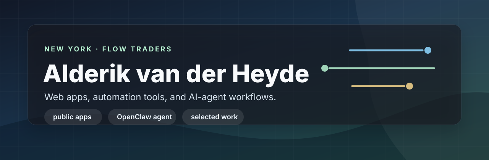

  

## Selected Work

[**vibeleaderboard.ai**](https://vibeleaderboard.ai)  
Leaderboard and tracking for vibe-coded products.

[**human-cost.com**](https://human-cost.com)  
A web app focused on making human time and cost easier to reason about.

[**resy-skill**](https://github.com/Avanderheyde/resy-skill)  
A skill for automating and extending Resy-related workflows.

[**claude-config**](https://github.com/Avanderheyde/claude-config)  
Configuration and setup patterns for Claude-based development workflows.

[**vibe-cost-tracker**](https://github.com/Avanderheyde/vibe-cost-tracker)  
A tracker for measuring and understanding the cost of vibe-coded projects.

[**human-cost**](https://github.com/Avanderheyde/human-cost)  
Source for Human Cost.

[**basket-tracker**](https://github.com/Avanderheyde/basket-tracker)  
A tracking tool for monitoring baskets, backtests, or related workflows.

[**agentboard**](https://github.com/not0xjarvis/agentboard)  
A board for tracking agent work.
